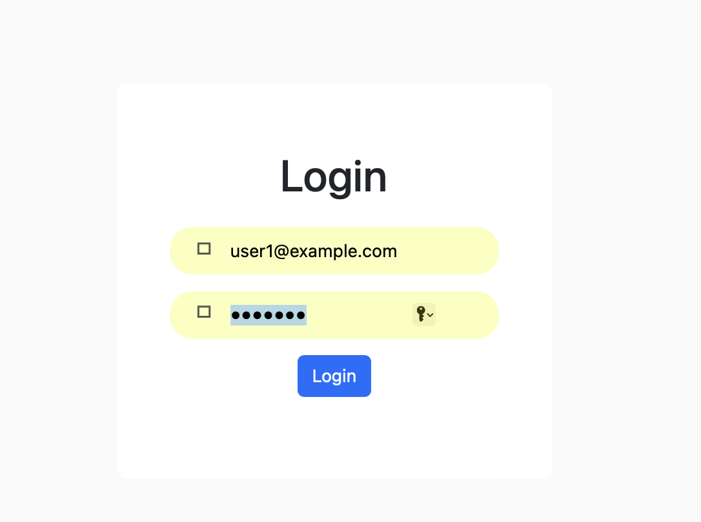

# First Install All Packages 
Run `npm install -legacy-peer-deps`

# Start Project
Run `bash`
Run  `ng serve` to start the Prodect
Then open the link showed as the result, it might be  http://localhost:4200/

// First Start Node setup then
Enter User email & password
email `user1@example.com`
password `user123`

# Libraries I used

header : ng-bootstrap
Angular : type-script
All Table : ag-grid
Dashboard Graph : Apex-chart

# the appalication 
Open the brower and then you have to log in with username and password.

Then you will enter the home page. On this page, you could add products to your cart.

After that, go to the cart in the header, and then you could have the product you chose in your cart.

Then click the blue button on cart page and then click order on the header. It will show like that:

Click the "Docs"button on the header, and you will see the introduction of how to use this e-commerce platform.
